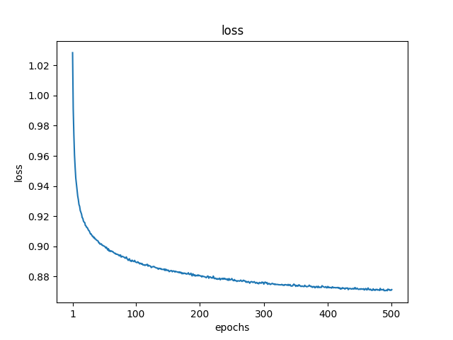
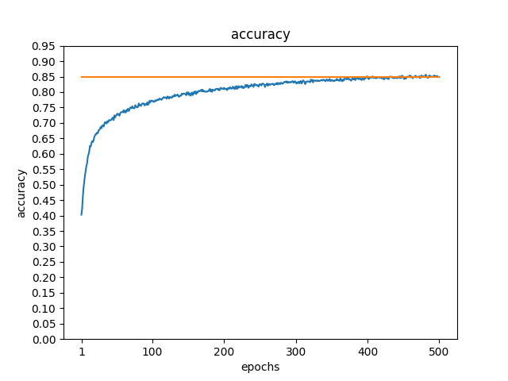

# Multi class cifar10 classification using weighted knn on contrastive learned data representation
This is an implementation of self-supervised classification using contrastive learning according to [simclr](https://arxiv.org/abs/2002.05709) paper.

# Results
I have used resnet18 and got 84.8 accuracy in 500 epochs.

 

# Requirements:
The code has been tested with following dependencies:
* torch 1.13.1+cu116
* tqdm 4.64.1
* matplotlib 3.6.3